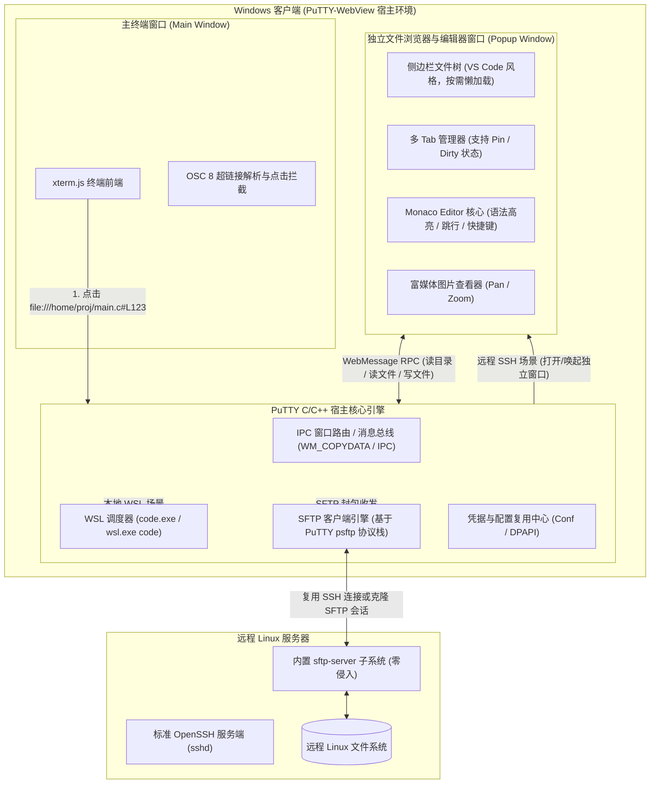
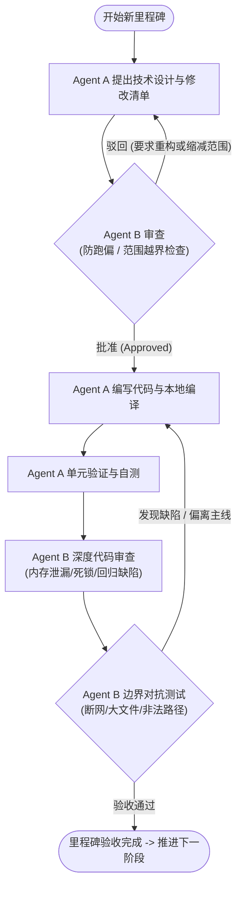

# PuTTY-WebView: SFTP 远程文件浏览器与 Monaco 编辑器工程计划书
## 架构方案、里程碑任务拆解与 A-B 双 Agent 对抗协作工作流

---

## 一、项目背景与需求定义

在现代终端开发体验中，开发者经常需要在终端查看日志、报错输出，并迅速跳转到源码或查看配置文件。
- **WSL 本地场景**：代码与环境位于本地，追求以最低延迟直接唤起 VS Code 并定位至指定代码行。
- **SSH 远程场景**：针对每个远程会话，点击终端中的文件超链接或快捷按钮，弹出一个**完全独立的窗口**（独立于当前主终端），内置**类似 VS Code 的“文件浏览器 + 多 Tab 编辑器”**。

### 核心功能需求清单
1. **独立弹窗宿主**：基于独立 Win32 + WebView2 实例，不阻塞也不干扰主终端的交互与性能。
2. **零侵入 SFTP 引擎**：利用 PuTTY 自身内置的 SFTP 客户端协议栈，直接复用当前 SSH 会话或会话凭据克隆 SFTP 管道，**服务器端无需安装任何额外服务或开启额外端口**。
3. **多 Tab 与固定标签 (Pin Tab)**：支持多文件同时打开，支持标签页 Pin 固定、关闭其他、关闭已保存，修改未保存时显示脏标记（Dirty Indicator）。
4. **Monaco Editor 深度集成**：内置微软 Monaco 编辑器（VS Code 核心），提供专业的 C/C++、Java、Python、Rust、Go、Shell、JSON 等语法高亮、代码折叠与快捷键。
5. **跨窗口联动精准跳行**：主终端点击 `ML86306Ctl.c:1779` 时，独立编辑器窗口自动获得焦点，若文件未打开则自动加载打开，并平滑滚动高亮定位至第 1779 行。
6. **图片与多媒体即时预览**：检测到 `.png`、`.jpg`、`.svg`、`.gif` 等图片文件时，自动进入富媒体查看器，支持鼠标滚轮缩放与拖拽查看。
7. **双向编辑与保存**：支持在编辑器中修改代码并按 `Ctrl+S` 安全回写到远程 Linux 服务器。

---

## 二、系统总体架构设计

---

## 三、A-B 双 Agent 对抗协作机制规范

为保证本大工程在全生命周期中**高质量推进、不偏离主线、不破坏原有 PuTTY 稳定性**，全面实行 **A-B 双 Agent 对抗协作流**：

### 1. 角色定位与权责划分

| 角色 | 代号 | 核心职责 | 考核准则 |
| :--- | :--- | :--- | :--- |
| **实施 Agent** | **Agent A (Builder)** | • 负责具体方案拆解、C/C++ 源码编写、前端 HTML/JS/CSS 编码、编译构建与部署调试。 • 产出清晰的模块实现与自测用例。 | 交付效率、代码规范度、功能完整性。 |
| **守门 Agent** | **Agent B (Guardrail / Devil's Advocate)** | • 负责**架构防跑偏**、**代码破坏性审查**、**边界风险识别**与**性能/内存安全把控**。 • 具有一票否决权（Veto Power）：对过度设计、破坏既有稳定性、侵入服务器端的行为坚决叫停。 | 风险拦截率、主线聚焦度、回归稳定性。 |

### 2. A-B 对抗与门禁工作流流程图

### 3. Agent B 的“防跑偏”核心红线 (The 5 Redlines)
1. **绝对零侵入原则**：严禁在远程 Linux 服务器端强制安装常驻 Agent、Daemon 或要求开放非 SSH 端口。
2. **主干稳定性原则**：严禁因新增 SFTP 或 Editor 窗口功能破坏 PuTTY 经典终端的数据收发、ConPTY 兼容性或 SSH 鉴权流程。
3. **内存与资源生命周期原则**：独立弹窗必须能够干净彻底地销毁（包含 WebView 实例与关联的 SFTP channel），严禁内存泄漏与句柄悬挂。
4. **轻量聚焦原则**：禁止在初期盲目堆砌未经过讨论的复杂 IDE 插件系统，牢牢聚焦于“文件浏览、查看、高亮、跳行、编辑、图片预览”这六大核心体验。
5. **增量交付原则**：每个阶段必须保证可编译、可运行、可独立验证，拒绝“跨越多个模块一次性大爆炸式修改”。

---

## 四、分阶段里程碑演进计划

### 里程碑 1：WSL 唤起机制优化与通用化实测
- **目标**：彻底解决 WSL 在不同机器、不同发行版下的通用性与鲁棒性。
- **任务清单**：
  1. **检讨与实施 WSL 唤起方案**：
     - 支持通过 Windows 注册表精确探测 `Code.exe` 安装位置（兜底）。
     - 支持检测是否为原生 Linux 路径（如 `/home/...`），若为内部路径，自动采用无窗口后台进程执行 `wsl.exe -d <distro> code -g <path>:<line>`，直接唤起 VS Code WSL Remote 模式！
  2. **A-B 门禁**：Agent B 验证挂载盘路径（`/mnt/c/...`）与 Linux 原生路径（`/home/...`）的兼容性。

### 里程碑 2：独立 WebView2 弹窗宿主与双向消息总线
- **目标**：实现从主终端通过菜单或点击事件，拉起一个专属的独立 Win32 窗口并承载独立 WebView2。
- **任务清单**：
  1. 在 C 宿主中增加 `WebViewEditorWindow` 窗口类与生命周期管理。
  2. 建立主终端窗口、C 宿主、独立编辑器窗口三者之间的 IPC 路由总线。
  3. 制作基础独立窗口 HTML 脚手架，验证窗口聚焦、销毁与基本通信。
  4. **A-B 门禁**：Agent B 重点审查多窗口管理中的内存释放与窗口关闭逻辑，杜绝主窗口卡死。

### 里程碑 3：PuTTY C 宿主 SFTP 通道引擎封装
- **目标**：把 PuTTY 现有的 SFTP 客户端协议栈模块化，封装为面向 Web 前端的异步 JSON RPC 接口。
- **任务清单**：
  1. 封装 SFTP 会话初始化（复用当前 SSH 凭据，在后台新建 SFTP channel）。
  2. 实现核心文件操作接口：
     - `sftp_list_dir(path)`: 获取目录清单（包含文件名、大小、权限、修改时间、是否为目录）。
     - `sftp_read_file(path)`: 读取文件内容（支持 UTF-8 文本或二进制 Base64）。
     - `sftp_write_file(path, content)`: 回写保存文件。
     - `sftp_stat(path)`: 获取单个文件属性与文件类型识别。
  3. **A-B 门禁**：Agent B 进行并发读写压力测试与网络超时/权限拒绝错误处理测试。

### 里程碑 4：前端 Monaco Editor 集成与多 Tab 状态机
- **目标**：在独立窗口中搭建纯离线、现代化的 VS Code 风格编辑界面。
- **任务清单**：
  1. 集成离线版 Monaco Editor，配置主流语言语法高亮支持（C, C++, Java, Python, Go, Shell, JSON, Markdown）。
  2. 实现专业的多 Tab 管理系统：
     - 标签切换、新建、关闭。
     - **固定标签 (Pin Tab)**：双击或快捷键固定，防止被临时预览替换。
     - **脏数据检测 (Dirty Indicator)**：文件有未保存修改时显示小圆点，关闭时提示保存。
  3. 实现左侧可折叠的目录树（按需展开懒加载，避免一次性读取远程庞大目录树）。
  4. **A-B 门禁**：Agent B 审查前端资源打包体积与渲染性能，确保窗口启动耗时 < 300ms。

### 里程碑 5：富媒体图片预览与跨窗口跳行联动闭环
- **目标**：打通终端超链接到编辑器精准行定位的全链路，并支持图片直接查看。
- **任务清单**：
  1. **图片查看器**：识别 `.png`, `.jpg`, `.jpeg`, `.gif`, `.svg`, `.webp`，自动呈现为图片预览视图，支持滚轮平移与缩放。
  2. **终端跳行通信**：主终端点击 `\x1b]8;;file:///home/user/test.c#L120\x1b\` 时：
     - C 宿主通过 IPC 定位到该 SSH 会话对应的独立编辑器窗口（若未打开则唤起）。
     - 编辑器窗口激活并打开 `test.c`，调用 `editor.revealLineInCenter(120)` 并高亮该行。
  3. **保存闭环**：按 `Ctrl+S` 时，通过 SFTP 安全原子写入（先写临时文件后 rename，防止写入中断损坏原文件）。
  4. **A-B 门禁**：全功能端到端对抗演练，由 Agent B 模拟极端网络波动、只读文件修改保存、超大文本加载等异常场景。

---

## 五、A-B 协作执行指南（供后续开发使用）

在实际进入具体里程碑开发时，执行以下交互规则：
1. **Agent A 发起指令**：列出即将修改的源文件与核心逻辑；
2. **Agent B 进行对抗提问**：
   - 是否存在潜在崩溃点？
   - 是否增加了不必要的外部依赖？
   - 是否严格遵循了“零侵入服务端”原则？
3. **达成共识后实施**：Agent A 编码并构建；
4. **Agent B 代码审查与回归测试**：确保原有终端与新功能均稳健运行；
5. **归档与更新 Walkthrough**。
